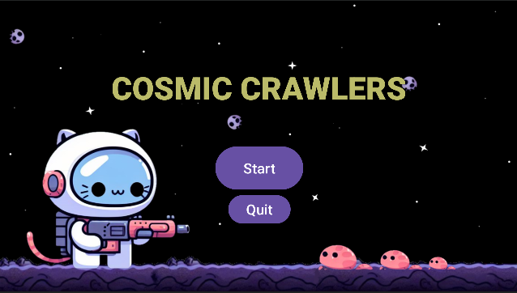

# Cosmic Crawlers

Cosmic Crawlers is an implementation of the game Dungeon Crawlers to the theme of Cats in Space written in Java using Android Studio for CS2340 Fall 2023. 

The game features 4 sections the player (as a astronaut cat) flies through to get to the spaceship while defeating 'ruff' enemies. Power-ups are also available throughout the map to help the player in their journey.
